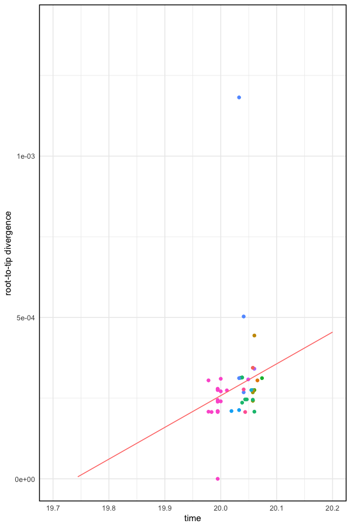

# 2019nCoV

Updated: Jan-31-2019 | added Australian and German genome\
Jan-30-2019\
@sungml92 // sl74@rice.edu\
\
Preliminary Phylogenetic and evolutionary analysis of 2019 nCoV genomes.\
\
Phylogenetic analysis with publicy shared 2019nCoV genomes from GISAID epiflu database. As of Jan-31-2019, there are 52 betaCov 2019-2020 submissions on GISAID.

### Phylogenetic analysis
Of 52 submissions, 51 are betaCov 2019-2020 genome and one genome is suspected common ancestor for the novel coronavirus. We reports preliminary findings for 48 betaCov 2019-2020 genome (removed, 1: partial genome, and 2: missing accurate isolation date).

Maximum likelihood (ML) phylogenetic tree was estimated wih RaxML v8.2.8 \[1\] and Maximum Clade Credibility (MCC) tree was estimated with BEAST v1.10.4 \[2\]. Both trees are visualized with ggtree package in R. A Wuhan sequence isolated on 12/24/2019 was used as an outgroup in ML tree for tree visualization.

ML tree            |  root-to-tip
:-------------------------:|:-------------------------:
  |  

###### MCC tree

There is a discrepancy between ML tree and MCC tree due to EPI_ISL_406592. Sequencing error? 

### Divergence timing

BEASTv.1.10.4 software was used to calculate a estimated date of the most recent common ancestor. We considered constant size coalescent model.

|   | tMRCA \[95% HPD\] |
| ------------- | ------------- |
| Constant Size Coalescent Model  | 2019.602 \[2019.279-2019.848\]  |
| without EPI_ISL_406592  | 2019.881 \[2019.78-2019.958\]  |

95% HPD of tMRCA estimation is broad, possibly due to inclusion of EPI_ISL_406592 genome. It is uncertain whether the genome has sequencing errors.

### Sequence variation
(add sequence variation)

### Evolutionary analysis

MEME \[3\] was run to identify any sites under episodic positive selection within sample population. No signals, but signals in orf1ab, orf3a, S, and orf7a, and N after adding outgroup Yunnan bat virus.

The evolutionary rate of the virus from 48 full genomes.

|   | mean rate year-1 nucleotide-1 \[95% HPD\] |
| ------------- | ------------- |
| Constant Size Coalescent Model  | 1.35E-3 \[0.606E-3 - 2.2E-3\]  |

### Note

As pointed out by \[4\], tMRCA and mean rate is an estimate for sampled population that only span about an year. Especially for tMRCA, only its range can be used as a guide to estimate common sampled ancestor. 

### Sampling location of 48 nCoV genomes

| Location | Count |
| ------------- | ------------- |
| Wuhan  | 18  |
| Guanggdong  | 8 |
| Shenzhen  | 4  |
| Foshan  | 3 |
| Zhejiang  | 2  |
| California  | 2 |
| France  | 2  |
| Nonthanburi  | 2 |
| Arizona  | 1  |
| Guangzhou  | 1 |
| Illinois  | 1  |
| Taiwan  | 1 |
| Washington  | 1 |
| Germany  | 1 |
| Australia  | 1 |
| Total | 48 |

### Reference
1. Stamatakis, A. (2014). RAxML version 8: A tool for phylogenetic analysis and post-analysis of large phylogenies. Bioinformatics (Oxford, England), 30(9), 1312–1313. https://doi.org/10.1093/bioinformatics/btu033
\
2. Suchard, M. A., Lemey, P., Baele, G., Ayres, D. L., Drummond, A. J., & Rambaut, A. (2018). Bayesian phylogenetic and phylodynamic data integration using BEAST 1.10. Virus Evolution, 4(1). https://doi.org/10.1093/ve/vey016
\
3. Murrell, B., Wertheim, J. O., Moola, S., Weighill, T., Scheffler, K., & Pond, S. L. K. (2012). Detecting Individual Sites Subject to Episodic Diversifying Selection. PLOS Genetics, 8(7), e1002764. https://doi.org/10.1371/journal.pgen.1002764
\
4. http://virological.org/t/phylodynamic-analysis-of-ncov-2019-genomes-29-jan-2020/353 
\
