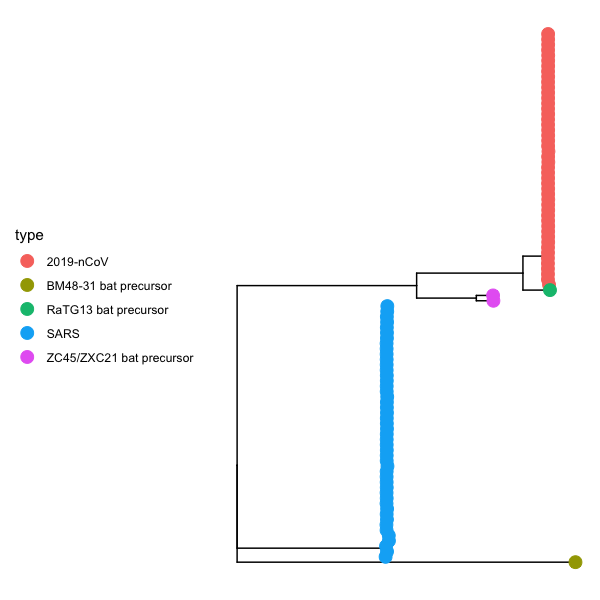

# 2019nCoV

Update: Feb-03-2019 | added England, Finland, Singapore, Zhejiang and Genbank genomes\
old Update: Jan-31-2019 | added Australian and German genome\
Jan-30-2019\
@sungml92 // sl74@rice.edu\
\
Preliminary Phylogenetic and evolutionary analysis of 2019 nCoV genomes.\
\
Phylogenetic analysis with publicy shared 2019nCoV genomes from GISAID epiflu database. As of Jan-31-2019, there are 61 betaCov 2019-2020 submissions on GISAID.

### Phylogenetic analysis
Of 61 submissions, 60 are betaCov 2019-2020 genome and one genome is suspected common ancestor for the novel coronavirus. We reports preliminary findings for 51 betaCov 2019-2020 genome (removed, 3: partial genome, 2: missing accurate isolation date, 4: substantial sequencing error) + including NCBI genomes (or EPI_ISL_406716 and EPI_ISL_406717 in EpiFlu).

Maximum likelihood (ML) phylogenetic tree was estimated wih RaxML v8.2.8 \[1\] and Maximum Clade Credibility (MCC) tree was estimated with BEAST v1.10.4 \[2\]. Both trees are visualized with ggtree package in R. A Wuhan sequence isolated on 12/24/2019 was used as an outgroup in ML tree for tree visualization.

ML tree            |  root-to-tip
:-------------------------:|:-------------------------:
  |  

### Divergence timing

BEASTv.1.10.4 software was used to calculate a estimated date of the most recent common ancestor. We considered 1) constant size coalescent model and 2) exponential growth coalescent model.

|   | tMRCA \[95% HPD\] |
| ------------- | ------------- |
| Constant Size Coalescent Model  | 2019.894 \[2019.812-2019.958\]  |
| Exponential Growth Coalescent Model  | 2019.NNN \[2019.NNN-2019.NNN\]  |

### Evolutionary analysis

MEME \[3\] was run to identify any sites under episodic positive selection within sample population. No signals, but signals in orf1ab, orf3a, S, and orf7a, and N after adding outgroup Yunnan bat virus.

The evolutionary rate of the virus from 48 full genomes.

|   | mean rate year-1 nucleotide-1 \[95% HPD\] |
| ------------- | ------------- |
| Constant Size Coalescent Model  | 1.15E-3 \[0.574E-3 - 1.79E-3\]  |
| Exponential Growth Coalescent Model  | 1.NNE-3 \[0.NNE-3 - N.NNE-3\]  |

###### estimated mutation rate for other coronaviruses
| | nucleotide substitution site-1 year-1 x10-3 \[95% CI\] | Source
| ------------- | ------------- | ------------- |
| SARS | 0.80 - 2.38 | \[4\] |
| MERS | 1.12 \[0.876 - 1.37\] | \[5\] |

### Sequence variation
(add sequence variation)

### Coronavirus relationship

2019-nCoV is closely related to SARS-CoV, BM48-41 bat coronavirus lineage and ZXC21/ZC45 SARS-like bat coronavirus lineage. The novel virus has shown close relationship to Yunnan/RaTG13 bat coronavirus and this virus is suspected to be the nearest bat precursor. 

 

### S gene similarity

pblast similarity among 2019nCoV-SARS cluster + MERS. Representative genome was used for 2019-nCoV (Wuhan-Hu-1), SARS (Tor2), and MERS (EMC).

| percentage identity (%) | S region | S2 region |
| ------------- | ------------- | ------------- |
| RaTG13 precursor  | 97.41  | 99.8 |
| ZXC21 precursor  | 80.32 | 94.18 |
| ZC45 precursor  | 81  | 93.78 |
| SARS  | 75.96 | 88.76 |
| BM48-31  | 71.66  | 86.87 |
| MERS  | 35.1 | 42.28 |

### Note

As pointed out by \[6\], tMRCA and mean rate is an estimate for sampled population that only span about an year. Especially for tMRCA, only its range can be used as a guide to estimate common sampled ancestor. 

Substantial sequencing error caused the distance EPI_ISL_406592. See discussion on Virological, https://bit.ly/386ZLuI.

### Sampling location of 48 nCoV genomes

| Location | Count |
| ------------- | ------------- |
| Wuhan  | 18  |
| Guanggdong  | 8 |
| Shenzhen  | 4  |
| Foshan  | 3 |
| Zhejiang  | 2  |
| California  | 2 |
| France  | 2  |
| Nonthanburi  | 2 |
| Arizona  | 1  |
| Guangzhou  | 1 |
| Illinois  | 1  |
| Taiwan  | 1 |
| Washington  | 1 |
| Germany  | 1 |
| Australia  | 1 |
| Total | 48 |

### Reference
1. Stamatakis, A. (2014). RAxML version 8: A tool for phylogenetic analysis and post-analysis of large phylogenies. Bioinformatics (Oxford, England), 30(9), 1312–1313. https://doi.org/10.1093/bioinformatics/btu033
\
2. Suchard, M. A., Lemey, P., Baele, G., Ayres, D. L., Drummond, A. J., & Rambaut, A. (2018). Bayesian phylogenetic and phylodynamic data integration using BEAST 1.10. Virus Evolution, 4(1). https://doi.org/10.1093/ve/vey016
\
3. Murrell, B., Wertheim, J. O., Moola, S., Weighill, T., Scheffler, K., & Pond, S. L. K. (2012). Detecting Individual Sites Subject to Episodic Diversifying Selection. PLOS Genetics, 8(7), e1002764. https://doi.org/10.1371/journal.pgen.1002764
\
4. Zhao, Z., Li, H., Wu, X., Zhong, Y., Zhang, K., Zhang, Y.-P., Boerwinkle, E., & Fu, Y.-X. (2004). Moderate mutation rate in the SARS coronavirus genome and its implications. BMC Evolutionary Biology, 4(1), 21. https://doi.org/10.1186/1471-2148-4-21
\
5. Cotten, M., Watson, S. J., Zumla, A. I., Makhdoom, H. Q., Palser, A. L., Ong, S. H., Al Rabeeah, A. A., Alhakeem, R. F., Assiri, A., Al-Tawfiq, J. A., Albarrak, A., Barry, M., Shibl, A., Alrabiah, F. A., Hajjar, S., Balkhy, H. H., Flemban, H., Rambaut, A., Kellam, P., & Memish, Z. A. (2014). Spread, Circulation, and Evolution of the Middle East Respiratory Syndrome Coronavirus. MBio, 5(1). https://doi.org/10.1128/mBio.01062-13
\
6. http://virological.org/t/phylodynamic-analysis-of-ncov-2019-genomes-29-jan-2020/353 
